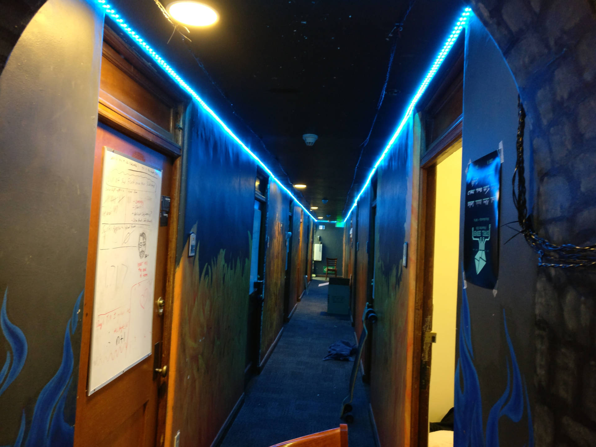

## Hell-Lighting-Arduino

The Arduino code for Hell Lighting. Handles switching between patterns and
running user patterns, including reading serial data from the Raspberry
Pi.

If you would like to upload to the most current installed Hell Lighting board, please use the "master" branch.

If you'd like to contribute to this project, read the [Contributing Guide](https://www.github.com/Whillikers/Hell-Lighting/blob/master/CONTRIBUTING.md)
